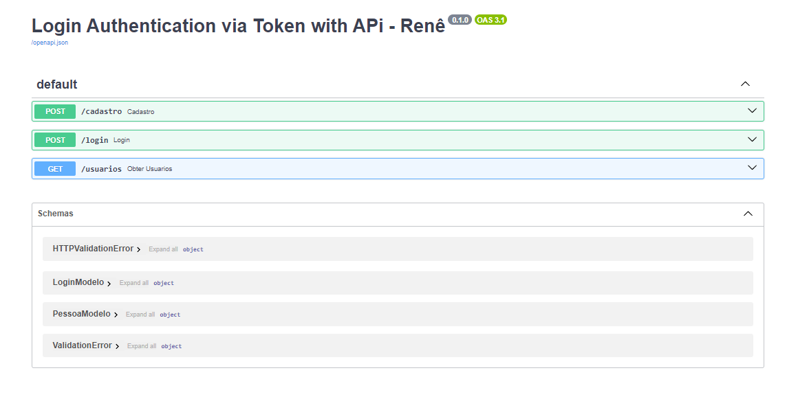

# FastAPI Auth API


## Descrição

Esta é uma API simples desenvolvida com FastAPI para autenticação de usuários. Ela permite o cadastro e login de usuários, além de consultar a lista de usuários cadastrados.

## Endpoints

### Cadastro de Usuário
Cadastro de Usuário
POST /cadastro

- **Body**:
  ```json
  {
    "username": "string",
    "password": "string"
  }
- 
- **Obter Usuários**: 
GET /usuarios

  ```json
  Utilizar String Param (token_param) :
  http://127.0.0.1:2020/usuarios?token_param=205d0f70631e4719dc278ae11b41d5


- **Execute a aplicação:**:  
  ```json
  uvicorn app.main:app --reload

- **Documentação API:**: 



